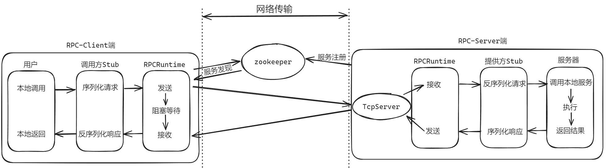
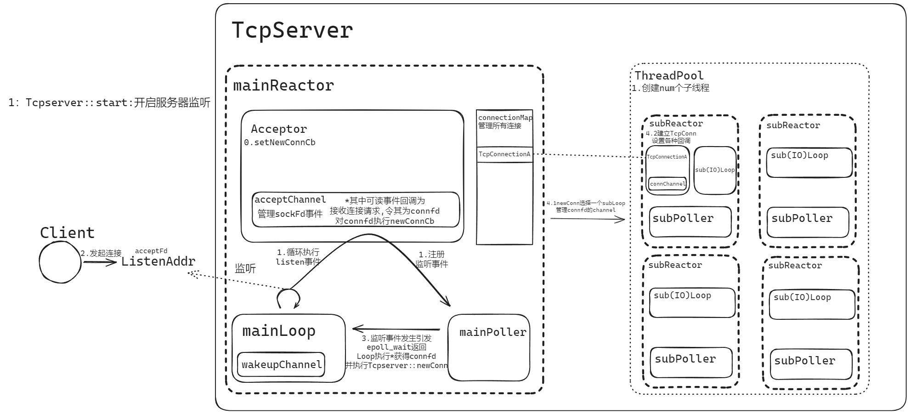

# tinyRPC

RPC，即 Remote Procedure Call（远程过程调用），调用远程计算机上的服务，就像调用本地服务一样。RPC 可以很好的解耦系统，如 WebService 就是一种基于 Http 协议的 RPC。

tinyRPC 旨在建立一个高性能、易用的 C++1X RPC 库，让使用者即使不懂得网络通信，也可以通过直接使用它搭建 RPC 服务，使用者只需要关注自己的业务逻辑。

tinyRPC 采用基于 Reactor 模式的 TcpServer 作为 Server 端，Zookeeper 实现服务发布，Protobuf 进行消息的序列化和反序列化，代理模式透明化服务调用，tinyXML 读取配置信息。

RPC 架构图：


-   使用 Zookeeper 实现服务发布。
    -   客户端能够动态发现服务，实现服务调用的高可用性。客户端与 Zookeeper 采用长连接，减少服务发现频繁 Tcp 三次握手造成的开销，框架内采用 cache 缓存服务节点，并利用 Zookeeper 的 watch 机制及时更新服务节点列表。
    -   支持故障转移，确保在部分服务器宕机时，请求能够路由至正常运行的服务器。
-   隐藏网络通信细节，提供简洁、直观的服务调用接口，降低业务层开发人员的学习成本，快速上手并使用本框架。

TcpServer 架构图：


-   采用的多 Reactor 结构。每一个线程都可以看作是一个 Reactor，主线程（主 Reactor）只负责监听接收新连接，并将接收的连接对应的 fd 分发到子 Reactor 中，子线程（子 Reactor）就负责处理主线程分发给自己的 fd 上的事件，比如 fd 上发生的可读、可写、错误等事件，另外从 fd 上读取数据后，要进行的业务逻辑也是由子线程负责的。 非阻塞网络 I/O 模型配合 I/O 多路复用函数，实现高吞吐量。
-   采用了" one loop per thread "线程模型，一个线程只有一个事件循环；一个 fd 只由一个线程进行读写，但一个线程可以管理多个 fd。避免了一个 fd 由多个线程处理时会发生的“串话”等问题。

# 目录结构

-   examples：tinyRpc 使用样例
-   src/comm：框架通用的基础设施，配置、日志、时间戳等
-   src/net：框架的网络库部分
-   src/rpc：框架的 rpc 部分
-   test：测试文件
-   thirdparty：第三方库

# 使用

tinyRPC 为用户提供了非常简单易用的接口，几行代码就可以实现 RPC 通信了，看一个 echo 例子。

1. 根据发布服务的 IP 设置好配置文件

    ```xml
    <!-- 服务器配置 -->
    <?xml version="1.0" encoding="UTF-8" ?>
    <root>
    <rpcServer>
        <serv_ip>127.0.0.1</serv_ip>
        <serv_port>8000</serv_port>
    </rpcServer>

    <zookeeper>
        <zk_ip>127.0.0.1</zk_ip>
        <zk_port>2181</zk_port>
    </zookeeper>
    </root>
    ```

    客户端不需要发布服务因此不需要提供本地的 ip 地址

    ```xml
    <!-- 客户端配置 -->
    <?xml version="1.0" encoding="UTF-8" ?>
    <root>
    <zookeeper>
        <zk_ip>127.0.0.1</zk_ip>
        <zk_port>2181</zk_port>
    </zookeeper>
    </root>
    ```

2. 设置 Protobuf 消息定义接口，语法格式参考[Protobuf 官方文档](https://protobuf.dev/)

    ```protobuf
    //example.proto
    syntax="proto3";

    package example;

    option cc_generic_services = true;

    message ResultCode
    {
        int32 errCode=1;
        bytes errMsg=2;
    }

    message Request
    {
        bytes msg=1;
    }

    message Response
    {
        ResultCode resultCode=1;
        bytes handledMsg=2;
    }

    service ServiceRpc
    {
        rpc Get(Request)returns(Response);
    }
    ```

    在终端执行`protoc --cpp_out=target/path/ source/path/file.proto`，如`protoc --cpp_out=./ ./example.proto`，将在 target_path 下生成 example.pb.cc 和 example.pb.h 两个文件。

3. 服务端发布服务

    ```c++
    #include "example.pb.h"
    #include "RpcServer.h"

    class foo : public example::ServiceRpc
    {
    public:
        void Get(::google::protobuf::RpcController *controller,
                 const ::example::Request *request,
                 ::example::Response *response,
                 ::google::protobuf::Closure *done)
        {
            // 获取request相应数据
            std::string msg = request->msg();
            std::cout << "RPC_Server receive message: " << msg << std::endl;

            // 做本地业务
            std::string handledMsg = Get(msg);

            // 写入response
            response->set_handledmsg(handledMsg);
            response->mutable_resultcode()->set_errcode(0);
            response->mutable_resultcode()->set_errmsg("");

            // 回调 即RpcServer::sendRpcRespones,将response序列化发送回调用方
            done->Run();
        }
    private:
        std::string Get(std::string str)
        {
            return "Handled Message:" + str;
        }
    };

    int main(int argc, char **argv)
    {
        // 读取配置
        Config::loadCfgFile(argc, argv, Config::cfgType::server);
        // 初始化一个4线程的RpcServer
        RpcServer rpcServ(4);
        // 发布服务
        rpcServ.registerService(new foo());
        // 开启服务
        rpcServ.start();
    }
    ```

    服务端只需`include`生成的接口定义头文件`example.pb.h`以及`RpcServer.h`，即可发布 Rpc 服务。重点在于需要创建一个继承`example::ServiceRpc`的类，覆写在`proto`文件中的`service`方法，如本例的`Get`。`.pb.h`文件提供了一系列`get`与`set`方法，能够从`request`获取远端提供的字段数据，并执行本地业务后将结果设置进`response`中。

    在 main 函数中，4 行即可开启 rpc 服务。

    1. 读取配置，并设置读取配置的类型为 server
    2. 初始化一个`numThreads`个线程的 RpcServer
    3. 将上述继承`example::ServeiceRpc`的类注册进 RpcServer，Rpc 框架内部会将提供的所有服务注册到 zookeeper 上
    4. 开启服务

4. 客户端请求服务

    ```c++
    #include "example.pb.h"
    #include "RpcClient.h"
    int main(int argc, char **argv)
    {
        // 读取配置
        Config::loadCfgFile(argc, argv, Config::cfgType::client);

        std::string str;
        std::cin >> str;

        // 初始化stub
        example::ServiceRpc_Stub stub(new RpcChannel());
        example::Request args;
        example::Response response;
        RpcController ctrler;

        // 设置请求字段
        args.set_msg(str);

        //请求Rpc服务
        stub.Get(&ctrler, &args, &response, nullptr);
        if (!ctrler.Failed())
            std::cout << "rpc invoke success: " << response.handledmsg() << std::endl;
        else
            std::cout << "rpc invoke failed" << ' ' << ctrler.ErrorText() << std::endl;

    }
    ```

    与本地调用函数不同的是，客户端不能直接调用函数，而是将请求字段的内容设置进`example::Request`，通过调用 stub 的对应成员方法函数实现。Rpc 框架提供的 stub 隐藏了底层的网络通信，使得用户能轻易实现一次网络通信。若因弱网、网络分区等网络通信情况导致 Rpc 调用失败，将会将失败原因记录在 RpcController 中，供用户根据情况自定义处理方法。
